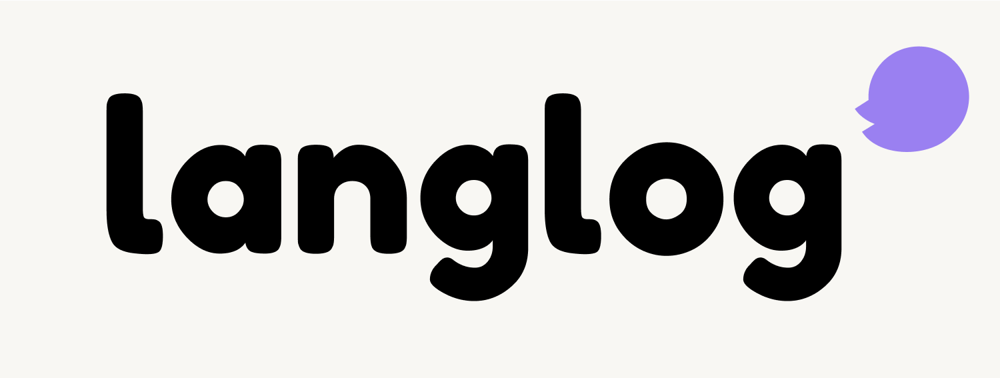

#  Langlog(랭글로그)
<p align='center'>
    
    
</p>
Langlog 는 Language + Log 의 합성어로 외국어 학습을 재미있고 효율적으로 만들어주는 일기 앱입니다. 일기를 통해 매일의 경험, 감정, 생각을 외국어로 자유롭게 기록할 수 있습니다. 일상에서의 낯선 외국어 사용을 일기 쓰는 습관을 통해 익숙하게 만들어줍니다. AI 튜터가 다양한 언어의 문법과 표현 등을 교정해주기 때문에 효과적으로 언어 능력을 향상시킬 수 있습니다. 외국어 공부를 고민하고 있는 당신! 어려운 외국어 공부를 일상에서 자연스럽게 시작해보는건 어떠세요?

### 👇 지금 바로 스토어에서 만나보세요 ❤️‍🔥
<p align='start'>
    <a href='https://apps.apple.com/kr/app/langlog/id6741313630'>
        
    </a>
</p>

## 📍 주요 기능
### 1️⃣ 소셜 로그인
- 구글과 애플 계정으로 간편하게 회원가입 및 로그인할 수 있습니다.
- 개인정보처리 방침에 동의해야 이용이 가능합니다.

### 2️⃣ 홈 & 작성된 일기
- 달력을 사용하여 일기 작성 여부를 한 눈에 확인할 수 있습니다.
- 오늘 날짜와 오른쪽 하단 버튼을 통해 일기를 작성할 수 있습니다.
- 달력의 상단을 클릭하면 원하는 날짜 페이지로 이동할 수 있습니다.
- 달력을 양 옆으로 스크롤하면 직전/직후 달력을 확인할 수 있습니다.
- Today 버튼을 통해 달력을 오늘 날짜로 포커싱할 수 있습니다.
- 랭글이가 있는 날짜를 클릭하면 이전에 작성한 일기를 볼 수 있습니다.
- 작성된 일기는 외국어와 한국어 탭으로 분리되어 있으며, 작성하지 않은 일기에 대해서는 비활성화 처리되어 있습니다.
- 작성된 일기 페이지에서는 해당 일기를 삭제할 수 있습니다.

### 3️⃣ 일기 작성
- 오늘의 감정을 선택할 수 있습니다.
- 외국어 일기로 바로 작성하기 어렵다면 한국어 일기를 먼저 작성할 수 있습니다.
- 어떤 내용으로 일기를 작성해야할지 막막함을 느낀다면 랜덤으로 주제를 추천받을 수 있습니다.
- 일기 작성을 완료하기 전 외국어 일기에 대한 내용을 교정받을 수 있습니다.
- 일기 내용은 사용자 기기에 저장되므로 안심하고 작성하셔도 됩니다.
- 하루에 1개의 일기만 작성을 할 수 있고, 수정이 불가능합니다.
- 일기를 수정하고 싶다면 삭제 후 다시 작성해야 합니다.

### 4️⃣ 외국어 일기 교정
- 문장 교정은 하루에 한번만 받을 수 있습니다.
- 일기 작성 후 AI 에게 문장 교정을 받을 수 있습니다.
- 교정받은 문장은 빨간색으로, 권장하는 문장은 초록색으로 표시됩니다.
- 교정 이유까지 자세한 피드백이 제공됩니다.

### 5️⃣ 프로필 & 설정
- 작성한 일기 수, 앱 방문일을 실시간으로 업데이트하여 사용자가 확인할 수 있습니다.
- 개인정보처리 방침 및 서비스 이용 정보는 Webview 로 확인할 수 있습니다.
- 로그아웃 및 회원탈퇴를 할 수 있습니다.
- 회원탈퇴 시 사용자 피드백이 전송됩니다.

## 📁 Project Folder
클린아키텍쳐를 기반으로 MVVM 패턴 사용
```
📦lib
 ┣ 📂constant
 ┣ 📂core
 ┣ 📂data
 ┃ ┣ 📂data_source
 ┃ ┣ 📂dto
 ┃ ┣ 📂repository
 ┣ 📂domain
 ┃ ┣ 📂entity
 ┃ ┣ 📂repository
 ┃ ┗ 📂usecase
 ┣ 📂presentation
 ┃ ┣ 📂pages
 ┃ ┃ ┣ 📂day_log_detail
 ┃ ┃ ┣ 📂day_log_write
 ┃ ┃ ┣ 📂emotion_mood
 ┃ ┃ ┣ 📂home
 ┃ ┃ ┃ ┣ 📂_tap
 ┃ ┃ ┃ ┃ ┣ 📂bookmark
 ┃ ┃ ┃ ┃ ┣ 📂home
 ┃ ┃ ┃ ┃ ┗ 📂my_log
 ┃ ┃ ┣ 📂login
 ┃ ┃ ┗ 📂my
 ┃ ┗ 📂widgets
 ┣ 📂providers
 ┣ 📜main.dart
```

## 🛠 기술 스택
- Framework: Flutter
- Language: Dart
- State Management: Riverpod
- Server: Firebase
- Authentication: Firebase Authentication
- DB: Hive, Firebase Cloud